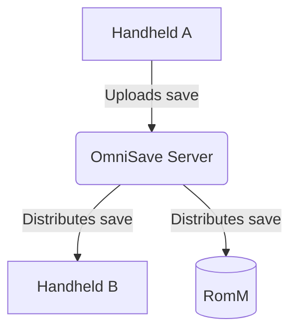

# 

# OmniSave

If you play games across multiple devices, you've likely run into this problem: You play on your primary device. Later, you pick up a secondary handheld. The save on the handheld is older. Now you have to remember which device has the newest progress, or manually transfer files. 

OmniSave is a self-hosted save synchronization platform built for messy reality: offline play, multiple devices, crashes, and interrupted transfers. When a save changes on one device, OmniSave automatically backs up the old version, sets the new upload as the active version, and distributes it to your other devices.

---

### Key Behaviors

OmniSave is a self-hosted save synchronization and backup platform designed to solve this. When a save changes on one device, OmniSave automatically distributes it to your other devices so they are always up to date.

The goal is simple: The newest save syncs automatically, but every previous version is backed up. You never lose a save, even if one gets overwritten.

### What OmniSave Does

At a high level:

1. A save changes on one device.
2. The local client detects the change.
3. The save is uploaded to your OmniSave server.
4. The server archives the previous save and sets the new upload as the current active version.
5. Other registered devices receive the update automatically.
6. You continue playing exactly where you left off.

If something goes wrong—or if you just want to go back in time—you can easily select any older save from the server and push it back to your devices.

### Features

* **Automatic Save Synchronization:** Keep save data perfectly synced between multiple hardware devices (e.g., Handheld ↔ Handheld, multiple family consoles, travel ↔ home).
* **Comprehensive Version Control:** It's not just that the new save wins. Older saves are automatically backed up. If a save gets overwritten or corrupted, you can effortlessly push an older version to your devices. You never lose a save.
* **Self-Hosted:** You run the server yourself. Your save data stays under your control. Deploys easily via Docker, Docker Compose, NAS, or a VPS.
* **Multi-User Support:** Multiple users can share the same OmniSave server instance. Each user maintains their own synchronization state, registered devices, and save ownership.
* **Save History & Auditing:** OmniSave tracks all save transactions and synchronization states. You can inspect sync activity, diagnose failures, and manage your backups through the web UI.
* **RomM Integration:** OmniSave can synchronize directly with RomM. This allows save data to be shared between active clients and a RomM-managed library without requiring manual exports.

---

### Architecture

This repository contains the **OmniSave Server**. It runs on your hardware (Docker host, NAS, VPS) and acts as the central authority. It does not execute game code or read local memory; it strictly manages files, versions, and sync states.

The server manages uploads in idempotent chunks, verifies integrity before committing, and coordinates distribution to other devices via leases.

---

### Clients & Roadmap

OmniSave is completely client-agnostic. The protocol is an open REST API, allowing for clients to be developed independently. 

**Current Clients:**
* **Official Client (Custom Firmware):** A sysmodule that watches saves and moves files on console hardware.
* **REST API:** Fully documented for custom scripts.

**Roadmap:**
* PC client (Playnite integration)
* Emulator support natively via the PC client
* Experimental cross-device save conversion
* Data Retention Automation - game level, global defaults in settings

---

### Project Status

OmniSave is under active development. 

The primary focus is **correctness and reliability**. Features are added only after synchronization behavior is proven to be safe and predictable. Because irreplaceable save data is involved, avoiding corruption takes priority over feature velocity. 

**Tech Stack:**
* Backend: Python (FastAPI)
* Database: SQLite
* Dashboard: React
* Integrations: Optional RomM integration

---

### Installation

*Documentation stubs – links to be added*

* **Server Setup Guide** (Docker/Compose instructions)
* **Client Setup**
* **Managing and Restoring Backups**
* **RomM Integration Guide**

# License 

OmniSave uses a split licensing model to balance open ecosystem growth with sustainable infrastructure development.

Client Software (Sysmodule, UI, SDK)

Licensed under the MIT License.

You are free to use, modify, distribute, and integrate the client software into other applications, including homebrew projects, with minimal restrictions.

Server Software

Licensed under the GNU Affero General Public License v3.0 (AGPLv3).

You are free to self-host the OmniSave server for personal or internal use. If you modify the server and provide it as a network-accessible service, the AGPLv3 requires you to make the modified server source code available under the same license.

OmniSave Cloud (Official Hosting)

The official managed OmniSave cloud service is a proprietary commercial offering operated by the OmniSave project maintainers.
