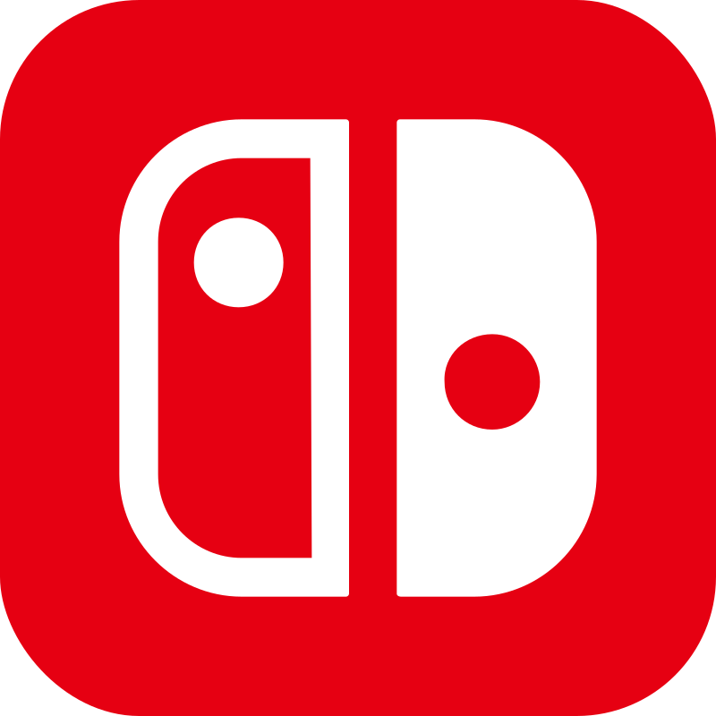
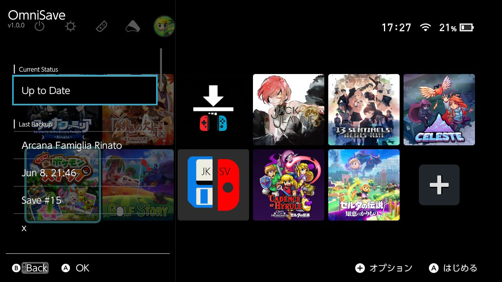

<table align="center" border="0" cellspacing="0" cellpadding="12"><tr>
  <td align="center" valign="middle"></td>
  <td align="center" valign="middle"><b>+</b></td>
  <td align="center" valign="middle"></td>
</tr></table>

<h1 align="center">OmniSaveSwitch</h1>

<p align="center">
  The background sync client for <a href="https://github.com/kanjieater/OmniSaveServer">OmniSave</a>. Runs on custom firmware, syncing your saves automatically whenever you close a game.
</p>

<p align="center">
  <a href="#requirements">Requirements</a> ·
  <a href="#installation">Installation</a> ·
  <a href="#configuration">Configuration</a> ·
  <a href="#pairing-your-device">Pairing</a> ·
  <a href="#the-overlay">Overlay</a> ·
  <a href="#building-from-source">Building</a>
</p>

---

OmniSaveSwitch runs silently in the background as a sysmodule. Every time you close a game, it extracts the save and keeps a local copy on your SD card — no configuration required, no server needed.

If you connect it to an [OmniSave Server](https://github.com/kanjieater/OmniSaveServer), the local copies are uploaded and distributed to your other devices automatically, and the SD card copies are cleaned up so they don't accumulate. The server also gives you cross-device sync, a full version history, and a web dashboard.

An Ultrahand overlay lets you check sync status, see your last backup and restore, and trigger a full backup from the home screen.

---

<p align="center">
  
</p>

---

## What You Get

### Without a server

- **Local save backups, automatically.** Every time you close a game, the sysmodule extracts the save and stores it on your SD card. No setup beyond installing the sysmodule.
- **Batch backup from the home screen.** The overlay's "Backup All" action queues a full extraction of every installed game's saves at once.

### With an OmniSave Server

Everything above, plus:

- **Saves sync to your other devices.** The local copies are uploaded to the server and distributed automatically — no manual transfers.
- **No duplicate accumulation on your SD card.** Without a server, extracted saves stay on the card indefinitely. With a server, they're uploaded and cleaned up.
- **Every version is kept on the server.** The server keeps a full history; the card stays tidy.
- **Saves download automatically.** When another device uploads a newer save, it's restored here before the game launches next time.
- **Multiple profiles on one device.** Each in-game player profile has its own save slot on the server. Saves go to and from the right account without any manual mapping.
- **SysNAND/EmuNAND aware.** If you run both environments, a single config option makes them register as separate devices on the server so their saves don't conflict. (Primarily tested on SysNAND.)
- **Sleep-aware.** A pending upload pauses before the device goes to sleep and resumes on wake.
- **No impact on gameplay.** Uploads happen entirely in the background over your local network.

---

## Requirements

- Custom firmware running [Atmosphère](https://github.com/Atmosphere-NX/Atmosphere)
- [Ultrahand](https://github.com/ppkantorski/Ultrahand-Overlay) for the overlay and notifications
- *(Optional)* An [OmniSave Server](https://github.com/kanjieater/OmniSaveServer) — needed for cross-device sync and remote version history

---

## Installation

### Sysmodule

Download `OmniSave-vX.Y.Z.zip` from the [latest release](https://github.com/kanjieater/OmniSaveSwitch/releases/latest) and drag both folders onto the root of your SD card:

```
atmosphere/
└── contents/
    └── 420000000000000C/
        ├── exefs.nsp       ← the sysmodule binary
        ├── toolbox.json    ← lets you start/stop it without rebooting
        └── flags/
            └── boot2.flag  ← auto-starts at boot
switch/
├── .overlays/
│   └── OmniSave.ovl        ← the overlay binary
└── omnisave/
    └── config.ini          ← pre-populated default configuration
```

After copying, edit `switch/omnisave/config.ini` to set your `server_address`, then start the sysmodule.

### First launch

The sysmodule won't be running yet after copying the files. You have two options:

- **Without rebooting:** Open the Ultrahand menu → **Sysmodules** → find OmniSave → toggle it on. This hot-loads the sysmodule without a reboot and is the fastest way to start or stop it at any time.
- **With a reboot:** Cold boot the device. The `boot2.flag` file tells Atmosphère to start the sysmodule automatically on every boot going forward.

Once the sysmodule is running, open the OmniSave overlay in Ultrahand to confirm it's active.

---

## Configuration

The release archive includes a pre-populated `switch/omnisave/config.ini`. If the file is missing, the sysmodule creates it on first boot. Defaults:

```ini
# OmniSave Configuration
server_address=
device_token=
nickname=
verbose_notifications=0
device_suffix=
```

Edit the file to point at your server and set a nickname. The `device_token` is filled in automatically after pairing — you don't need to set it manually.

| Key | Description |
|---|---|
| `server_address` | Full URL of your OmniSave server (e.g. `http://192.168.1.10:8991`). Supports `http://` and `https://`. |
| `device_token` | Set automatically after pairing. Do not edit manually. |
| `nickname` | Optional label sent to the server on first registration. The server uses it as the default device name. |
| `verbose_notifications` | Set to `1` to also receive notifications for conflict and sweep events (default `0`). |
| `verify_tls` | Set to `0` if your server uses a self-signed certificate. |
| `device_suffix` | Optional. Appended to the device ID to distinguish environments (e.g. `device_suffix=emu` for EmuNAND). |

### SysNAND and EmuNAND

If you run both SysNAND and EmuNAND, each needs its own `config.ini` with a different `device_suffix`. Without it, both environments report the same device ID and their saves will conflict on the server.

Typical setup:

- SysNAND `config.ini`: leave `device_suffix` empty
- EmuNAND `config.ini`: `device_suffix=emu`

---

## Pairing Your Device

The first time the sysmodule connects to your server, it generates a 6-character pairing code and displays it in the overlay. To complete pairing:

1. Open the Ultrahand menu and launch the OmniSave overlay.
2. The pairing code appears at the top of the overlay.
3. Open the OmniSave web dashboard → **Settings** → **Pair a New Device**.
4. Enter the code shown in the overlay.
5. The device receives its token automatically on its next poll.

After pairing, the code disappears from the overlay and syncing begins automatically. You can rename the device and assign a default player profile from the dashboard at any time.

---

## The Overlay

<p align="center">
  
</p>

Open the Ultrahand menu and select OmniSave. The overlay shows:

**Current Status** — what the sysmodule is doing right now:

| Status | Meaning |
|---|---|
| Up to Date | Idle — no pending uploads or downloads |
| Backing Up | Uploading a save, with game name and progress % |
| Downloading | Fetching a save from the server |
| Applying Save | Writing a downloaded save to the save file system |
| Network Issue | Upload failed; retrying automatically |
| Paused: Storage Full | SD card is over 95% full — sync paused |

**Last Backup / Last Restore** — the most recent save event: game name, timestamp, save version number, and which user account it belongs to. When a game is running, these sections show the history for that specific game. From the home screen, they show the most recent event overall.

**Actions** (home screen only) — **Backup All (Slow)** triggers a full backup of every installed game's saves. Runs in the background; the sysmodule works through them one at a time. This is only available when no game is running because save extraction requires the save file system to be unlocked.

**Errors** — any sync errors that need attention. Errors can be cleared from the OmniSave web dashboard.

**Recent Events** — the last 10 sync events with timestamps.

---

## SD Card Layout

The sysmodule uses `/switch/omnisave/` for all its files:

```
/switch/omnisave/
├── config.ini          ← your configuration
├── state/
│   ├── status.json     ← live FSM state (read by overlay)
│   ├── pairing.json    ← pairing code (cleared after pairing)
│   ├── last_backup.json
│   ├── last_restore.json
│   └── events.json
├── signals/
│   └── batch_backup.request   ← written by overlay to trigger batch backup
└── errors/             ← one file per error; cleared via dashboard
```

---

## Known Limitations

**5 GB save size limit**

Saves larger than 5 GB cannot be uploaded or synced. 99% of Switch titles have saves well under a few MB. A small number of games with large world data reach several GB — Minecraft tops out around 4.4 GB, others like NBA 2K18 can exceed 5 GB and will hit this limit. If a save is over the limit the sysmodule will skip it and log `UPLOAD_TOO_LARGE`.

**Large saves take a while to upload**

Upload speed depends on your network. On a typical home LAN a 500 MB save takes under a minute. Uploading to a server over the internet at 2 MB/s takes about 4 minutes for 500 MB, or roughly 35 minutes for a 4 GB save. The upload happens in the background after you close the game, so it won't interrupt play, but the next device won't receive the save until the transfer completes.

**~3 MB memory footprint**

The sysmodule uses approximately 3 MB of system RAM while running. This is on the larger side for a background sysmodule. If you run many sysmodules simultaneously and experience instability, try disabling non-essential ones to rule out memory pressure.

**Background activity increases battery drain**

The sysmodule runs continuously and polls the network periodically while a server is configured. This does consume additional battery compared to running no sysmodules, though the impact in practice is small. If battery life is a concern — on a long trip without charging, for example — you can stop the sysmodule via the Ultrahand **Sysmodules** menu and re-enable it when you're back on your home network.

**Saves only upload when a game fully closes**

The sysmodule detects a game closing by watching for the game process to exit. Putting the device to sleep while a game is still running does not trigger a save extraction — the upload happens when you actually close the game. If the device crashes or powers off while a game is open, the current session's save will not be backed up.

**Concurrent play on two devices — last close wins**

If the same game is open on two devices at the same time, the last device to close the game becomes the new active version on the server. When device A uploads a save, device B receives it. If device B later closes the game, it uploads its own version (which may reflect older progress), and that overwrites device A's upload.

*Workaround:* From the server dashboard, open the game's snapshot history and push the version you want back to the appropriate device.

**Homebrew apps are not backed up**

Homebrew applications don't expose a standard title ID and don't use the system save filesystem, so the sysmodule has no way to identify them or extract their saves. Only retail games with a proper title ID are backed up. If a homebrew app stores data on the SD card directly (outside the save filesystem), that data is outside OmniSave's scope entirely.

**Without a server, backups accumulate on your SD card**

When running without a server, extracted saves are stored in `/switch/omnisave/outbound/` and never cleaned up automatically. On a large library with frequent play this directory can grow significantly over time. Connecting a server causes uploads to be cleaned up after they're confirmed received.

---

## Troubleshooting

**Pairing code never appears**

The sysmodule hasn't been able to reach the server. Check:
- `server_address` in `config.ini` is set and correct.
- The server is running and reachable from the device's network.
- If using `https://`, try `verify_tls=0` if the server uses a self-signed cert.

**Overlay shows "Sysmodule offline"**

The sysmodule isn't running. Confirm the sysmodule files are in the right place and that `boot2.flag` exists. Cold boot the device.

**Saves upload but never arrive on other devices**

Check the dashboard on the server — the save should appear in the game's history. If delivery to a specific device is stuck, use Dashboard → Devices → (device) → Errors to retry, or use Restore All after re-pairing.

**Device appears twice on the server**

This usually means `device_suffix` changed between runs, or the device ID was regenerated (e.g., after a nand restore). Pair the device again and use Restore All to re-queue all saves.

**Batch Backup runs slowly**

That's expected — it's labeled "Backup All (Slow)" because it works through every installed game sequentially, extracting and uploading each one. Let it run in the background.

---

## Building from Source

### Requirements

- [devkitPro](https://devkitpro.org/) with libnx installed
- [Ultrahand](https://github.com/ppkantorski/Ultrahand-Overlay) headers for the overlay

### Sysmodule

```bash
cd sysmodule
make
# Output: exefs.nsp (copied automatically from OmniSave.nsp)
```

### Overlay

```bash
cd overlay
make
# Output: omnisave.ovl
```

The `build.sh` script in the repo root builds both.

---

## Support

Community discussion on [KanjiEater's Discord](https://discord.com/invite/agbwB4p).

<a href="https://youtube.com/c/kanjieater"></a>
<a href="https://tr.ee/-TOCGozNUI" title="Twitter"></a>
<a href="https://discord.com/invite/agbwB4p" title="Discord"></a>

If you find my tools useful please consider supporting via Patreon.

<a href="https://www.patreon.com/kanjieater" rel="nofollow"></a>

---

## License

OmniSaveSwitch is licensed under the [MIT License](LICENSE-MIT) — use, modify, and distribute freely.

The server counterpart, [OmniSaveServer](https://github.com/kanjieater/OmniSaveServer), is licensed under AGPLv3.
