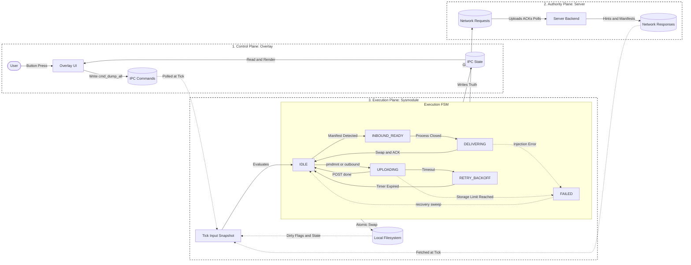

```mermaid
flowchart LR
    subgraph Control_Plane [1. Control Plane: Overlay]
        direction TB
        USER([User]) -->|Button Press| OVL[Overlay UI]
        OVL -->|Write cmd_dump_all| IPC_CMD[(IPC Commands)]
        IPC_STATE[(IPC State)] -->|Read and Render| OVL
    end

    subgraph Execution_Plane [3. Execution Plane: Sysmodule]
        direction TB
        TICK[Tick Input Snapshot]
        
        subgraph FSM [Execution FSM]
            direction TB
            IDLE
            UPLOADING
            INBOUND_READY
            DELIVERING
            RETRY_BACKOFF
            FAILED
            
            IDLE -->|pmdmnt or outbound| UPLOADING
            UPLOADING -->|POST done| IDLE
            UPLOADING -->|Timeout| RETRY_BACKOFF
            RETRY_BACKOFF -->|Timer Expired| IDLE
            IDLE -->|Manifest Detected| INBOUND_READY
            INBOUND_READY -->|Process Closed| DELIVERING
            DELIVERING -->|Swap and ACK| IDLE
            
            DELIVERING -.->|Injection Error| FAILED
            UPLOADING -.->|Storage Limit Reached| FAILED
            FAILED -.->|recovery sweep| IDLE
        end

        FS[(Local Filesystem)]

        %% Internal Execution Flow
        FS -.->|Dirty Flags and State| TICK
        TICK -->|Evaluates| IDLE
        FSM -->|Atomic Swap| FS
    end

    subgraph Authority_Plane [2. Authority Plane: Server]
        direction TB
        SRV[Server Backend]
        SRV -->|Hints and Manifests| NET_RES[(Network Responses)]
        NET_REQ[(Network Requests)] -->|Uploads ACKs Polls| SRV
    end

    %% Cross-Plane Signal Aggregation & Output
    IPC_CMD -.->|Polled at Tick| TICK
    NET_RES -.->|Fetched at Tick| TICK
    
    FSM --->|Writes Truth| IPC_STATE
    FSM --->|Generates| NET_REQ

    %% Visual styling for planes
    classDef plane fill:transparent,stroke:#555,stroke-width:2px,stroke-dasharray: 5 5;
    class Control_Plane,Authority_Plane,Execution_Plane plane;
```